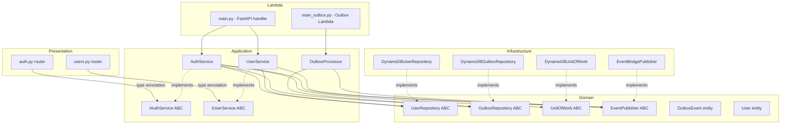
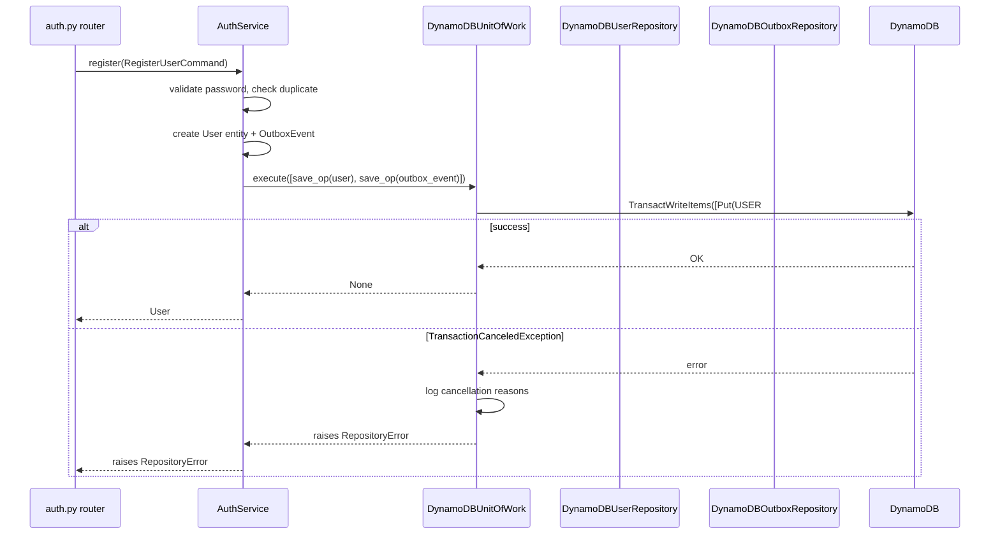
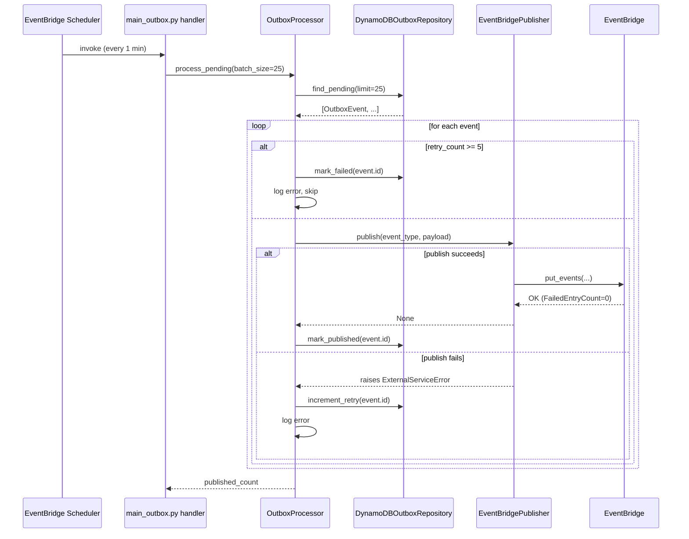

# Design Document — Identity Manager Enterprise Patterns

## Overview

This design covers four enterprise-pattern gaps in `ugsys-identity-manager`:

1. **Async EventBridge publisher** — replace synchronous `boto3` with `aioboto3` and surface errors instead of swallowing them.
2. **Outbox pattern** — guarantee at-least-once delivery of critical domain events by writing them atomically with the entity in a single `TransactWriteItems` call.
3. **Unit of Work** — abstract the DynamoDB transactional write behind a domain port so the application layer stays infrastructure-agnostic.
4. **Structural cleanup** — extract inline DTOs to `src/application/dtos/` and introduce `IAuthService`/`IUserService` inbound port interfaces.

The result is a service where critical events (`identity.user.registered`, `identity.user.deactivated`, `identity.auth.password_changed`) can never be silently lost, and where the presentation layer depends on stable abstractions rather than concrete service classes.

---

## Architecture

### Component Diagram



### Data Flow — Atomic Dual-Write (register)



### Data Flow — OutboxProcessor Delivery Loop



---

## Components and Interfaces

### 1. EventBridgePublisher (modified)

**File:** `src/infrastructure/messaging/event_publisher.py`

Current constructor stores `self._client = boto3.client("events", ...)` — a synchronous client created at startup. The new constructor stores `self._session: aioboto3.Session` and creates a short-lived async client per `publish()` call using an async context manager.

```python
class EventBridgePublisher(EventPublisherABC):
    def __init__(self, bus_name: str, region: str, session: aioboto3.Session) -> None:
        self._bus_name = bus_name
        self._region = region
        self._session = session

    async def publish(self, detail_type: str, payload: dict[str, Any]) -> None:
        async with self._session.client("events", region_name=self._region) as client:
            response = await client.put_events(Entries=[...])
        if response["FailedEntryCount"] > 0:
            raise ExternalServiceError(...)
```

Key changes:
- Remove `self._client` from `__init__`
- Add `session: aioboto3.Session` parameter
- `publish()` opens/closes the client per call (consistent with DynamoDB pattern in `main.py`)
- `FailedEntryCount > 0` → `ExternalServiceError` (was silently ignored)
- `except Exception` → log + re-raise as `ExternalServiceError` (was swallowed)

### 2. OutboxEvent (new domain entity)

**File:** `src/domain/entities/outbox_event.py`

```python
@dataclass
class OutboxEvent:
    id: str                        # ULID
    aggregate_type: str            # e.g. "User"
    aggregate_id: str              # entity ID
    event_type: str                # e.g. "identity.user.registered"
    payload: str                   # JSON string
    created_at: str                # ISO 8601
    status: str                    # "pending" | "published" | "failed"
    retry_count: int = 0
    published_at: str | None = None
```

Zero external imports. Pure Python dataclass.

### 3. OutboxRepository ABC (new domain port)

**File:** `src/domain/repositories/outbox_repository.py`

```python
class OutboxRepository(ABC):
    @abstractmethod
    async def save(self, event: OutboxEvent) -> OutboxEvent: ...
    @abstractmethod
    async def find_pending(self, limit: int) -> list[OutboxEvent]: ...
    @abstractmethod
    async def mark_published(self, event_id: str) -> None: ...
    @abstractmethod
    async def increment_retry(self, event_id: str) -> None: ...
    @abstractmethod
    async def mark_failed(self, event_id: str) -> None: ...
    @abstractmethod
    def save_operation(self, event: OutboxEvent) -> "TransactionalOperation": ...
```

Note: `save_operation` is synchronous — it builds and returns a `TransactionalOperation` without I/O.

### 4. UnitOfWork ABC + TransactionalOperation (new domain port)

**File:** `src/domain/repositories/unit_of_work.py`

```python
@dataclass
class TransactionalOperation:
    operation_type: str   # "Put" | "Update" | "Delete"
    params: dict[str, Any]

class UnitOfWork(ABC):
    @abstractmethod
    async def execute(self, operations: list[TransactionalOperation]) -> None: ...
```

### 5. DynamoDBOutboxRepository (new infrastructure adapter)

**File:** `src/infrastructure/persistence/dynamodb_outbox_repository.py`

Uses the low-level aioboto3 client (not the resource API) consistent with the pattern used in `DynamoDBTokenBlacklistRepository`. Constructor: `(table_name: str, client: Any)`.

All methods wrap `ClientError` via `_raise_repository_error()`. The `save_operation()` method returns a `TransactionalOperation` with a `Put` item — it does NOT call `put_item` directly.

### 6. DynamoDBUnitOfWork (new infrastructure adapter)

**File:** `src/infrastructure/persistence/dynamodb_unit_of_work.py`

Constructor: `(client: Any)` — same aioboto3 DynamoDB client used by the repositories.

Validates `0 < len(operations) <= 100` before calling `transact_write_items`. Handles `TransactionCanceledException` with cancellation reason logging.

### 7. UserRepository additions

**File:** `src/infrastructure/persistence/dynamodb_user_repository.py`

Two new methods added (existing `save()` and `update()` unchanged):

```python
def save_operation(self, user: User) -> TransactionalOperation:
    return TransactionalOperation(
        operation_type="Put",
        params={
            "TableName": self._table_name,
            "Item": self._to_item(user),
            "ConditionExpression": "attribute_not_exists(pk)",
        },
    )

def update_operation(self, user: User) -> TransactionalOperation:
    return TransactionalOperation(
        operation_type="Put",
        params={
            "TableName": self._table_name,
            "Item": self._to_item(user),
            "ConditionExpression": "attribute_exists(pk)",
        },
    )
```

Note: The existing `DynamoDBUserRepository` uses the high-level `boto3.resource` Table API. The `save_operation()` / `update_operation()` methods need to produce the low-level AttributeValue dict format expected by `transact_write_items`. This requires a `_to_item_low_level()` helper that produces `{"S": "..."}` typed values, separate from the existing `_to_item()` which produces plain Python values for the resource API.

### 8. AuthService changes

**File:** `src/application/services/auth_service.py`

New optional constructor parameters:
```python
outbox_repo: OutboxRepository | None = None
unit_of_work: UnitOfWork | None = None
```

`register()` change — replace:
```python
saved = await self._user_repo.save(user)
# ... publish event
```
With:
```python
outbox_event = OutboxEvent(
    id=str(ulid()),
    aggregate_type="User",
    aggregate_id=str(user.id),
    event_type="identity.user.registered",
    payload=json.dumps({
        "user_id": str(user.id),
        "email": user.email,
        "full_name": user.full_name,
        "verification_token": verification_token,
        "expires_at": expires_at.isoformat(),
    }),
    created_at=datetime.now(UTC).isoformat(),
    status="pending",
)
if self._outbox_repo and self._unit_of_work:
    await self._unit_of_work.execute([
        self._user_repo.save_operation(user),
        self._outbox_repo.save_operation(outbox_event),
    ])
    saved = user
else:
    saved = await self._user_repo.save(user)
    if self._events:
        await self._events.publish("identity.user.registered", {...})
```

The `else` branch preserves backward compatibility when outbox is not wired (e.g. in unit tests that don't need the full outbox setup).

`reset_password()` change — same pattern: replace `await self._user_repo.update(user)` + direct publish with `UnitOfWork.execute([update_op, outbox_op])`.

`forgot_password()` change — keep as log-and-continue but replace `reset_token` field in payload with `token_id` (the ULID/UUID identifier extracted from the token claims, not the raw JWT string).

### 9. OutboxProcessor (new application service)

**File:** `src/application/services/outbox_processor.py`

```python
class OutboxProcessor:
    def __init__(self, outbox_repo: OutboxRepository, publisher: EventPublisher) -> None: ...

    async def process_pending(self, batch_size: int = 25) -> int:
        start = time.perf_counter()
        events = await self._outbox_repo.find_pending(limit=batch_size)
        published = 0
        for event in events:
            if event.retry_count >= 5:
                await self._outbox_repo.mark_failed(event.id)
                logger.error("outbox.max_retries_exceeded", event_id=event.id, ...)
                continue
            try:
                await self._publisher.publish(event.event_type, json.loads(event.payload))
                await self._outbox_repo.mark_published(event.id)
                published += 1
            except Exception as e:
                logger.error("outbox.delivery_failed", event_id=event.id, error=str(e))
                await self._outbox_repo.increment_retry(event.id)
        logger.info("outbox.process_pending.completed",
                    published=published,
                    duration_ms=round((time.perf_counter() - start) * 1000, 2))
        return published
```

### 10. Outbox Lambda entry point

**File:** `src/main_outbox.py`

Standalone Lambda handler (no FastAPI, no Mangum). Uses `asyncio.run()` to drive the async outbox processor. Wires its own aioboto3 session and clients — independent of the main app's lifespan.

### 11. Application DTOs

**File:** `src/application/dtos/auth_dtos.py`

Extracts all request/response models currently defined inline in `src/presentation/api/v1/auth.py`:
- `RegisterUserRequest` (with `sanitize_name` validator)
- `LoginRequest`
- `RefreshRequest`
- `ForgotPasswordRequest`
- `ResetPasswordRequest`
- `VerifyEmailRequest`
- `ResendVerificationRequest`
- `ServiceTokenRequest`
- `TokenResponse`
- `ServiceTokenResponse`

**File:** `src/application/dtos/user_dtos.py`

Extracts models from `src/presentation/api/v1/users.py`:
- `UpdateProfileRequest`
- `AssignRoleRequest`
- `UserResponse` (with `from_domain()` classmethod)
- `PaginatedUsersResponse`

Router files import from `src/application/dtos/` and remove all inline Pydantic model definitions.

### 12. Inbound Port Interfaces

**File:** `src/application/interfaces/auth_service.py` — `IAuthService(ABC)`
**File:** `src/application/interfaces/user_service.py` — `IUserService(ABC)`

Each ABC declares abstract async methods matching the concrete service's public API. Router files type-annotate injected services as `IAuthService`/`IUserService`. Concrete classes declare `class AuthService(IAuthService)` and `class UserService(IUserService)`.

### 13. Config additions

**File:** `src/config.py`

```python
outbox_table_name: str = ""  # overrides computed property if set

@property
def outbox_table(self) -> str:
    if self.outbox_table_name:
        return self.outbox_table_name
    return f"ugsys-outbox-identity-{self.environment}"
```

### 14. main.py wiring updates

`_wire_dependencies()` additions:
- Create a single `aioboto3.Session()` shared across all adapters
- Instantiate `DynamoDBOutboxRepository(table_name=settings.outbox_table, client=dynamodb_client)`
- Instantiate `DynamoDBUnitOfWork(client=dynamodb_client)`
- Update `EventBridgePublisher(bus_name=..., region=..., session=session)`
- Pass `outbox_repo` and `unit_of_work` to `AuthService` constructor

---

## Data Models

### DynamoDB Outbox Table

```
Table name: ugsys-outbox-identity-{env}

Primary key:
  PK (S): OUTBOX#{ulid}
  SK (S): EVENT

Attributes:
  id          (S)  ULID — same value as in PK
  aggregate_type (S)  e.g. "User"
  aggregate_id   (S)  entity UUID
  event_type     (S)  e.g. "identity.user.registered"
  payload        (S)  JSON string
  created_at     (S)  ISO 8601 UTC
  status         (S)  "pending" | "published" | "failed"
  retry_count    (N)  default 0
  published_at   (S)  ISO 8601 UTC — absent until published

GSI: StatusIndex
  PK: status (S)
  SK: created_at (S)
  Projection: ALL

TTL attribute: ttl_epoch (N) — set to created_at + 7 days for published/failed events
```

### OutboxEvent Payload Examples

**identity.user.registered**
```json
{
  "user_id": "01JXXX...",
  "email": "user@example.com",
  "full_name": "Test User",
  "verification_token": "<jwt>",
  "expires_at": "2025-01-01T12:00:00+00:00"
}
```

**identity.user.deactivated**
```json
{
  "user_id": "01JXXX...",
  "email": "user@example.com"
}
```

**identity.auth.password_changed**
```json
{
  "user_id": "01JXXX...",
  "email": "user@example.com"
}
```

**identity.auth.password_reset_requested** (log-and-continue, NOT in outbox)
```json
{
  "user_id": "01JXXX...",
  "email": "user@example.com",
  "token_id": "01JYYY...",
  "expires_at": "2025-01-01T12:00:00+00:00"
}
```
Note: `token_id` is the ULID/jti claim from the reset token — never the raw JWT string.

---

## Correctness Properties

*A property is a characteristic or behavior that should hold true across all valid executions of a system — essentially, a formal statement about what the system should do. Properties serve as the bridge between human-readable specifications and machine-verifiable correctness guarantees.*

### Property 1: FailedEntryCount triggers ExternalServiceError

*For any* `put_events` response where `FailedEntryCount > 0`, `EventBridgePublisher.publish()` should raise an `ExternalServiceError` — regardless of the specific failed entry details.

**Validates: Requirements 1.4**

### Property 2: EventBridge client exceptions always propagate

*For any* exception raised by the aioboto3 EventBridge client during `put_events`, `EventBridgePublisher.publish()` should raise an `ExternalServiceError` — the exception is never swallowed.

**Validates: Requirements 2.1, 2.2**

### Property 3: Outbox save always writes pending status

*For any* `OutboxEvent`, when `DynamoDBOutboxRepository.save()` is called, the item written to DynamoDB should have `status = "pending"` and `retry_count = 0` — regardless of the values on the input entity.

**Validates: Requirements 5.3**

### Property 4: find_pending returns only pending events

*For any* DynamoDB outbox table containing a mix of `"pending"`, `"published"`, and `"failed"` events, `DynamoDBOutboxRepository.find_pending()` should return only events with `status = "pending"`.

**Validates: Requirements 5.4**

### Property 5: increment_retry always adds exactly 1

*For any* outbox event with an arbitrary `retry_count`, calling `DynamoDBOutboxRepository.increment_retry()` should result in `retry_count` being exactly `previous_retry_count + 1`.

**Validates: Requirements 5.6**

### Property 6: ClientError always becomes RepositoryError

*For any* `ClientError` raised by an aioboto3 DynamoDB call in `DynamoDBOutboxRepository`, the repository should raise a `RepositoryError` — the raw `ClientError` is never propagated to callers.

**Validates: Requirements 5.8**

### Property 7: UnitOfWork rejects oversized batches

*For any* list of `TransactionalOperation` with length > 100, `DynamoDBUnitOfWork.execute()` should raise a `RepositoryError` without calling `transact_write_items`.

**Validates: Requirements 6.3**

### Property 8: UnitOfWork passes all operations to transact_write_items

*For any* valid list of `TransactionalOperation` (length 1–100), `DynamoDBUnitOfWork.execute()` should call `transact_write_items` exactly once with all operations included.

**Validates: Requirements 6.4**

### Property 9: Critical operations use atomic dual-write

*For any* valid user registration, deactivation, or password reset, the corresponding `AuthService` method should call `UnitOfWork.execute()` with exactly two operations: one for the entity write and one for the outbox event write — never calling `UserRepository.save()` / `update()` directly for these paths.

**Validates: Requirements 7.1, 7.2, 7.3**

### Property 10: Transaction failure leaves no partial writes

*For any* `AuthService` critical operation where `UnitOfWork.execute()` raises a `RepositoryError`, neither the `User` item nor the `OutboxEvent` item should exist in the DynamoDB table after the failure.

**Validates: Requirements 7.4, 12.1**

### Property 11: Password reset outbox payload never contains raw token

*For any* call to `AuthService.forgot_password()`, if an outbox event is created for `identity.auth.password_reset_requested`, the `payload` JSON should not contain a field named `reset_token` or `verification_token` — only `token_id`.

**Validates: Requirements 8.1, 8.2**

### Property 12: OutboxProcessor return value equals successful publishes

*For any* batch of pending outbox events, `OutboxProcessor.process_pending()` should return a count equal to the number of events for which `EventPublisher.publish()` succeeded — not counting failed or skipped (max-retry) events.

**Validates: Requirements 9.1**

### Property 13: Successful publish triggers mark_published

*For any* pending outbox event where `EventPublisher.publish()` succeeds, `OutboxProcessor.process_pending()` should call `OutboxRepository.mark_published(event.id)` exactly once for that event.

**Validates: Requirements 9.3**

### Property 14: Delivery failure increments retry_count by exactly 1

*For any* pending outbox event where `EventPublisher.publish()` raises an `ExternalServiceError`, `OutboxProcessor.process_pending()` should call `OutboxRepository.increment_retry(event.id)` exactly once — the event's `retry_count` increases by exactly 1 per failed delivery attempt.

**Validates: Requirements 9.4, 12.2**

### Property 15: Events at max retries are marked failed, not retried

*For any* outbox event with `retry_count >= 5`, `OutboxProcessor.process_pending()` should call `OutboxRepository.mark_failed(event.id)` and should NOT call `EventPublisher.publish()` for that event.

**Validates: Requirements 9.5**

### Property 16: Outbox creation invariant for critical events

*For any* successful call to `AuthService.register()`, `AuthService.deactivate()`, or `AuthService.reset_password()`, the outbox table should contain exactly one `OutboxEvent` with the matching `event_type` and `aggregate_id` after the operation completes.

**Validates: Requirements 12.3**

---

## Error Handling

### EventBridgePublisher

| Condition | Behavior |
|-----------|----------|
| `put_events` raises any exception | Log `error` with `detail_type` + `error`, raise `ExternalServiceError` |
| `FailedEntryCount > 0` | Log `error` with failed entry details, raise `ExternalServiceError` |
| Success | Log `info` with `detail_type` + `event_id` |

### DynamoDBOutboxRepository

| Condition | Behavior |
|-----------|----------|
| Any `ClientError` | `_raise_repository_error()` → log full error, raise `RepositoryError` |
| `save()` on duplicate PK | `ConditionalCheckFailedException` → `RepositoryError` |

### DynamoDBUnitOfWork

| Condition | Behavior |
|-----------|----------|
| Empty operations list | Return immediately, no DynamoDB call |
| > 100 operations | Raise `RepositoryError` before any DynamoDB call |
| `TransactionCanceledException` | Log cancellation reasons at `error`, raise `RepositoryError` |
| Any other `ClientError` | Log error, raise `RepositoryError` |

### AuthService (critical paths)

| Condition | Behavior |
|-----------|----------|
| `UnitOfWork.execute()` raises `RepositoryError` | Propagate to caller — no partial state |
| `outbox_repo` or `unit_of_work` is `None` | Fall back to direct `save()`/`update()` + log-and-continue publish |

### OutboxProcessor

| Condition | Behavior |
|-----------|----------|
| `publish()` raises any exception | Log `error`, call `increment_retry()`, continue to next event |
| `retry_count >= 5` | Call `mark_failed()`, log `error`, skip delivery |
| `mark_published()` raises | Log `error`, continue (event will be re-delivered — idempotency required on consumers) |

---

## Testing Strategy

### Dual Testing Approach

Both unit tests and property-based tests are required. Unit tests cover specific examples, integration points, and error conditions. Property tests verify universal invariants across randomly generated inputs.

### Unit Tests

**Location:** `tests/unit/`

Key unit test scenarios:
- `EventBridgePublisher`: mock aioboto3 session, verify async context manager usage, verify `ExternalServiceError` on `FailedEntryCount > 0`, verify error propagation
- `DynamoDBOutboxRepository`: mock aioboto3 client, verify `_to_item` / `_from_item` round-trip, verify `save_operation()` returns correct `TransactionalOperation` without executing
- `DynamoDBUnitOfWork`: mock aioboto3 client, verify empty list returns immediately, verify > 100 raises `RepositoryError`, verify `TransactionCanceledException` handling
- `AuthService.register()`: mock `UnitOfWork` and `OutboxRepository`, verify `execute()` is called with two operations, verify backward-compat fallback when outbox not wired
- `OutboxProcessor`: mock `OutboxRepository` and `EventPublisher`, verify retry threshold, verify return count

### Integration Tests (moto)

**Location:** `tests/integration/`

Use `moto` `mock_aws` to simulate DynamoDB. Create both the users table and the outbox table with the correct GSI schema.

Key integration scenarios:
- `DynamoDBOutboxRepository.save()` + `find_pending()` round-trip
- `DynamoDBOutboxRepository.increment_retry()` atomic counter
- `DynamoDBUnitOfWork.execute()` with two Put operations — verify both items exist
- `DynamoDBUnitOfWork.execute()` with simulated `TransactionCanceledException` — verify neither item exists (atomicity)
- `AuthService.register()` end-to-end with moto — verify user item + outbox item both present

### Property-Based Tests

**Library:** `hypothesis` (Python)

**Configuration:** minimum 100 examples per property (`@settings(max_examples=100)`)

**Tag format:** `# Feature: identity-manager-enterprise-patterns, Property N: <property_text>`

Each correctness property (1–16) maps to exactly one property-based test. Key generators needed:
- `st.integers(min_value=1)` for `FailedEntryCount`
- `st.builds(OutboxEvent, ...)` for random outbox events
- `st.lists(st.builds(TransactionalOperation, ...), min_size=101, max_size=200)` for oversized batches
- `st.lists(st.builds(TransactionalOperation, ...), min_size=1, max_size=100)` for valid batches
- `st.integers(min_value=0, max_value=10)` for `retry_count` values

**Property test file locations:**
- `tests/property/test_event_publisher_properties.py` — Properties 1, 2
- `tests/property/test_outbox_repository_properties.py` — Properties 3, 4, 5, 6
- `tests/property/test_unit_of_work_properties.py` — Properties 7, 8
- `tests/property/test_auth_service_properties.py` — Properties 9, 10, 11, 12, 13, 14, 15, 16
