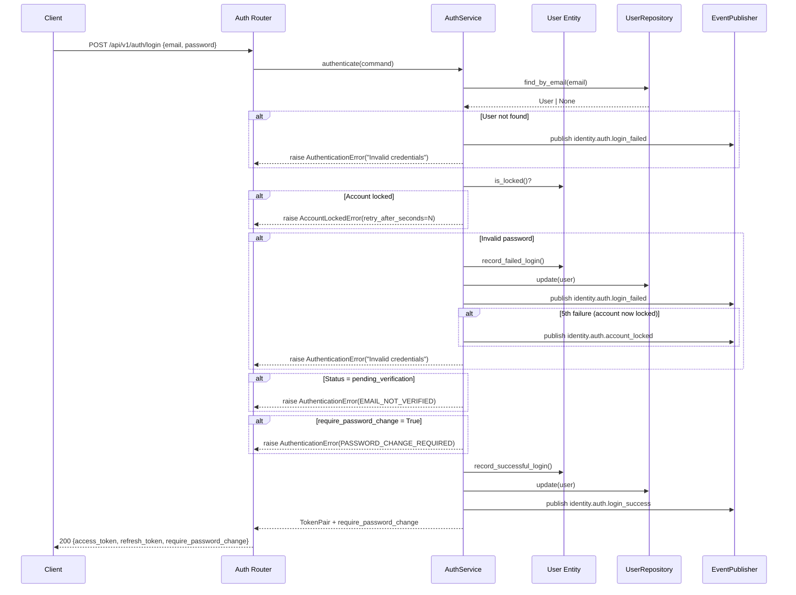
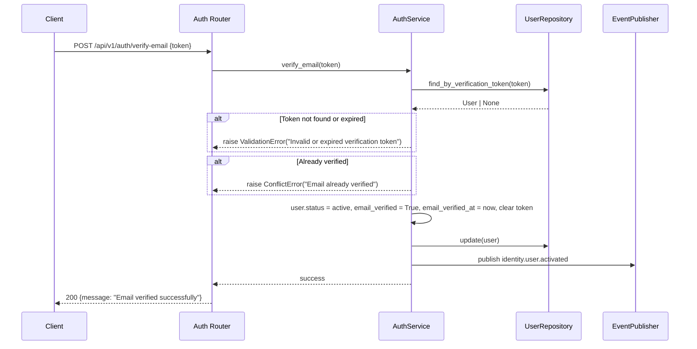
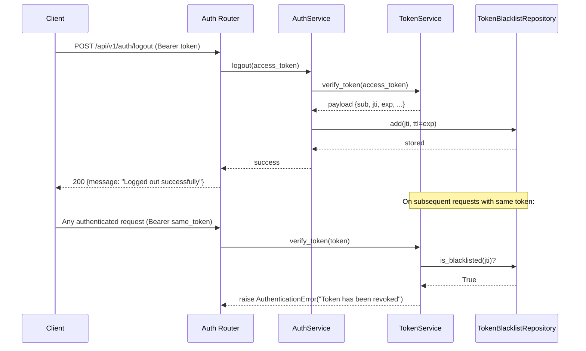

# Design Document — Identity Manager Phase 1 Completion

## Overview

This design closes all remaining implementation gaps in `ugsys-identity-manager` to reach Phase 1 completion as defined by the platform contract. The service already has a working hexagonal architecture with auth flows (register, login, refresh, forgot-password, reset-password), DynamoDB persistence, and EventBridge publishing.

The changes fall into four categories:

1. **Security hardening** — account lockout (5 failures → 30-min lock), token blacklist (jti-based revocation via DynamoDB TTL), password strength validation, login flow enforcement (email verification gate, password change gate)
2. **Missing flows** — email verification, resend verification, logout with server-side token revocation, validate-token S2S endpoint
3. **Admin operations** — suspend, activate, require-password-change endpoints with proper RBAC
4. **Standardization** — domain exception hierarchy (replacing raw ValueError/PermissionError), response envelope wrapping, event name alignment to platform contract, pagination on GET /users

All changes follow the existing hexagonal architecture. Domain entities and value objects are pure Python with zero external imports, making them instantly testable. Infrastructure adapters implement domain ports (ABCs), enabling unit tests with mocks at the port boundary.

### Design Priority: Testability First

Every component is designed for immediate testability:

- **Domain layer** (entities, value objects, exceptions) — pure Python, no dependencies, testable with plain `pytest`
- **Application layer** (services) — depends only on domain ports (ABCs), testable with `AsyncMock` at the repository boundary
- **Infrastructure layer** (DynamoDB adapters, JWT service) — implements domain ports, testable with `moto` for integration tests
- **Presentation layer** (routers, middleware) — testable with FastAPI `TestClient` and mocked services

## Architecture

The existing hexagonal architecture remains unchanged. New components slot into the established layer structure:

```
┌─────────────────────────────────────────────────────────────────────┐
│                        Presentation Layer                           │
│  ┌──────────────┐  ┌──────────────┐  ┌───────────────────────────┐ │
│  │ auth.py      │  │ users.py     │  │ middleware/                │ │
│  │ + verify     │  │ + suspend    │  │   exception_handler.py    │ │
│  │ + resend     │  │ + activate   │  │   (domain_exception_      │ │
│  │ + logout     │  │ + require-pw │  │    handler + unhandled)   │ │
│  │ + validate   │  │ + pagination │  └───────────────────────────┘ │
│  └──────┬───────┘  └──────┬───────┘                                │
│         │                  │          ┌───────────────────────────┐ │
│         │                  │          │ response_envelope.py      │ │
│         │                  │          │ (success_response,        │ │
│         │                  │          │  list_response,           │ │
│         │                  │          │  error_response)          │ │
│         │                  │          └───────────────────────────┘ │
└─────────┼──────────────────┼───────────────────────────────────────┘
          │                  │
┌─────────▼──────────────────▼───────────────────────────────────────┐
│                        Application Layer                            │
│  ┌──────────────────┐  ┌──────────────────┐                        │
│  │ AuthService       │  │ UserService       │                       │
│  │ + verify_email    │  │ + suspend_user    │                       │
│  │ + resend_verif    │  │ + activate_user   │                       │
│  │ + logout          │  │ + require_pw_chg  │                       │
│  │ + lockout logic   │  │ + list_users_pag  │                       │
│  │ + login gates     │  │                   │                       │
│  └──────┬────────────┘  └──────┬────────────┘                      │
│         │ (depends on ports)   │                                    │
└─────────┼──────────────────────┼────────────────────────────────────┘
          │                      │
┌─────────▼──────────────────────▼────────────────────────────────────┐
│                          Domain Layer                                │
│  ┌────────────────┐  ┌─────────────────┐  ┌──────────────────────┐  │
│  │ User entity     │  │ PasswordValidator│  │ exceptions.py        │  │
│  │ + new fields    │  │ (value object)   │  │ DomainError base     │  │
│  │ + is_locked()   │  │ validate()       │  │ + 8 specific types   │  │
│  │ + record_fail() │  └─────────────────┘  └──────────────────────┘  │
│  │ + reset_login() │                                                  │
│  │ + record_succ() │  ┌─────────────────────────────────────────────┐│
│  │ + verify_email()│  │ Ports (ABCs)                                ││
│  └────────────────┘  │  UserRepository (extended: list_paginated)   ││
│                       │  TokenService (extended: jti, blacklist)     ││
│                       │  TokenBlacklistRepository (new)              ││
│                       │  EventPublisher (new ABC — replaces Protocol)││
│                       └─────────────────────────────────────────────┘│
└──────────────────────────────────────────────────────────────────────┘
          ▲                      ▲
┌─────────┴──────────────────────┴────────────────────────────────────┐
│                       Infrastructure Layer                           │
│  ┌──────────────────────┐  ┌──────────────────────────────────────┐  │
│  │ DynamoDBUserRepo      │  │ DynamoDBTokenBlacklistRepo (new)    │  │
│  │ + new field ser/deser │  │ jti → TTL auto-expiry               │  │
│  │ + list_paginated()    │  └──────────────────────────────────────┘  │
│  │ + list_by_status()    │                                            │
│  └──────────────────────┘  ┌──────────────────────────────────────┐  │
│                             │ JWTTokenService                      │  │
│  ┌──────────────────────┐  │ + jti claim in all tokens            │  │
│  │ EventBridgePublisher  │  │ + blacklist check on verify          │  │
│  │ (ugsys-event-lib)    │  └──────────────────────────────────────┘  │
│  └──────────────────────┘                                            │
└──────────────────────────────────────────────────────────────────────┘
```

### Key Sequence Flows

#### Login with Lockout, Verification Gate, and Password Change Gate



#### Email Verification Flow



#### Logout with Token Blacklist



## Components and Interfaces

### Domain Layer — New/Modified Components

#### 1. Domain Exceptions (`src/domain/exceptions.py`) — NEW

```python
@dataclass
class DomainError(Exception):
    message: str                          # internal — logs only
    user_message: str = "An error occurred"
    error_code: str = "INTERNAL_ERROR"
    additional_data: dict[str, Any] = field(default_factory=dict)

class ValidationError(DomainError): ...       # 422
class NotFoundError(DomainError): ...         # 404
class ConflictError(DomainError): ...         # 409
class AuthenticationError(DomainError): ...   # 401
class AuthorizationError(DomainError): ...    # 403
class AccountLockedError(DomainError): ...    # 423
class RepositoryError(DomainError): ...       # 500
class ExternalServiceError(DomainError): ...  # 502
```

#### 2. User Entity Extension (`src/domain/entities/user.py`) — MODIFIED

New fields added to the existing `User` dataclass:

```python
# Security fields
failed_login_attempts: int = 0
account_locked_until: datetime | None = None
last_login_at: datetime | None = None
last_password_change: datetime | None = None
require_password_change: bool = False

# Verification fields
email_verified: bool = False
email_verification_token: str | None = None
email_verified_at: datetime | None = None

# Legacy compatibility
is_admin: bool = False
```

New methods:

```python
def is_locked(self) -> bool:
    """True when account_locked_until is set and in the future."""

def record_failed_login(self) -> None:
    """Increment failed_login_attempts; lock for 30 min at 5 failures."""

def reset_login_attempts(self) -> None:
    """Reset failed_login_attempts to 0 and clear account_locked_until."""

def record_successful_login(self) -> None:
    """Call reset_login_attempts() and set last_login_at to now UTC."""

def verify_email(self) -> None:
    """Set status=active, email_verified=True, email_verified_at=now, clear token."""

def generate_verification_token(self) -> str:
    """Generate UUID4 token, store on entity, return it."""
```

#### 3. UserRole Enum Extension — MODIFIED

Add missing roles: `MODERATOR`, `AUDITOR`, `GUEST`, `SYSTEM` (currently only has `SUPER_ADMIN`, `ADMIN`, `MEMBER`).

```python
class UserRole(StrEnum):
    SUPER_ADMIN = "super_admin"
    ADMIN = "admin"
    MODERATOR = "moderator"
    AUDITOR = "auditor"
    MEMBER = "member"
    GUEST = "guest"
    SYSTEM = "system"
```

#### 4. Password Validator (`src/domain/value_objects/password_validator.py`) — NEW

```python
@dataclass(frozen=True)
class PasswordValidator:
    SPECIAL_CHARS: ClassVar[str] = "!@#$%^&*()_+-=[]{}|;:,.<>?"
    MIN_LENGTH: ClassVar[int] = 8

    @staticmethod
    def validate(password: str) -> list[str]:
        """Return list of violated rules. Empty list = valid."""
```

Rules checked: min 8 chars, at least 1 uppercase, 1 lowercase, 1 digit, 1 special character. Returns a list of human-readable violation messages.

#### 5. Token Blacklist Repository Port (`src/domain/repositories/token_blacklist_repository.py`) — NEW

```python
class TokenBlacklistRepository(ABC):
    @abstractmethod
    async def add(self, jti: str, ttl_epoch: int) -> None: ...

    @abstractmethod
    async def is_blacklisted(self, jti: str) -> bool: ...
```

#### 6. UserRepository Extension — MODIFIED

Add paginated listing and filtered queries:

```python
# New methods on UserRepository ABC
@abstractmethod
async def list_paginated(
    self, page: int, page_size: int,
    status_filter: str | None = None,
    role_filter: str | None = None,
) -> tuple[list[User], int]: ...
    # Returns (users_page, total_count)

@abstractmethod
async def find_by_verification_token(self, token: str) -> User | None: ...
```

#### 7. TokenService Extension — MODIFIED

The `TokenService` ABC gains a `jti` requirement and blacklist integration:

```python
# Modified methods — jti included in all tokens
def create_access_token(self, user_id: UUID, roles: list[str]) -> str: ...
def create_refresh_token(self, user_id: UUID) -> str: ...

# verify_token now checks blacklist
def verify_token(self, token: str) -> dict[str, object]: ...
```

#### 8. Event Publisher Port (`src/domain/repositories/event_publisher.py`) — NEW

Replace the `EventPublisherProtocol` (typing.Protocol) in both services with a proper domain ABC:

```python
class EventPublisher(ABC):
    @abstractmethod
    async def publish(self, detail_type: str, payload: dict[str, Any]) -> None: ...
```

The source is always `"ugsys.identity-manager"` — hardcoded in the infrastructure adapter, not passed by callers.

### Application Layer — Modified Components

#### AuthService Changes

- **Constructor** — add `token_blacklist: TokenBlacklistRepository` and `password_validator: PasswordValidator` dependencies
- **register()** — validate password via `PasswordValidator`, generate verification token, set status to `pending_verification`, publish `identity.user.registered` (not `identity.user.created`)
- **authenticate()** — check `is_locked()` → `AccountLockedError`; check password → `record_failed_login()` on failure; check `pending_verification` → `AuthenticationError(EMAIL_NOT_VERIFIED)`; check `require_password_change` → `AuthenticationError(PASSWORD_CHANGE_REQUIRED)`; on success → `record_successful_login()`; publish correct events
- **verify_email(token)** — NEW: find user by verification token, validate not expired (24h), call `user.verify_email()`, publish `identity.user.activated`
- **resend_verification(email)** — NEW: find user, if pending_verification generate new token, publish `identity.auth.verification_requested`; always return success (anti-enumeration)
- **logout(access_token)** — NEW: extract jti from token, add to blacklist with TTL = token exp
- **reset_password()** — add password validation, publish `identity.auth.password_changed`
- **validate_token()** — return `{valid: false}` on invalid token instead of raising (per Req 14)
- Replace all `ValueError` raises with domain exceptions (`ConflictError`, `AuthenticationError`, etc.)

#### UserService Changes

- **suspend_user(user_id)** — NEW: set status to `inactive`, publish `identity.user.deactivated`
- **activate_user(user_id)** — NEW: set status to `active`, publish `identity.user.activated`
- **require_password_change(user_id)** — NEW: set `require_password_change = True`
- **list_users()** — add pagination params (page, page_size) and optional filters (status, role)
- Replace all `ValueError` raises with `NotFoundError`, `PermissionError` with `AuthorizationError`

#### New Commands

```python
# src/application/commands/verify_email.py
@dataclass(frozen=True)
class VerifyEmailCommand:
    token: str

# src/application/commands/resend_verification.py
@dataclass(frozen=True)
class ResendVerificationCommand:
    email: str

# src/application/commands/logout.py
@dataclass(frozen=True)
class LogoutCommand:
    access_token: str

# src/application/commands/update_user.py (additions)
@dataclass(frozen=True)
class SuspendUserCommand:
    user_id: UUID
    requester_id: str

@dataclass(frozen=True)
class ActivateUserCommand:
    user_id: UUID
    requester_id: str

@dataclass(frozen=True)
class RequirePasswordChangeCommand:
    user_id: UUID
    requester_id: str
```

#### Modified Queries

```python
# src/application/queries/list_users.py
@dataclass(frozen=True)
class ListUsersQuery:
    requester_id: str
    is_admin: bool
    page: int = 1
    page_size: int = 20
    status_filter: str | None = None
    role_filter: str | None = None
```

### Infrastructure Layer — New/Modified Components

#### DynamoDBTokenBlacklistRepository (`src/infrastructure/persistence/dynamodb_token_blacklist.py`) — NEW

Implements `TokenBlacklistRepository`. Writes `{jti, ttl}` items to `ugsys-identity-{env}-token-blacklist` table. DynamoDB TTL auto-expires items.

#### DynamoDBUserRepository — MODIFIED

- **_to_item / _from_item** — serialize/deserialize all new User fields with backward compatibility (missing attributes default to safe values)
- **list_paginated()** — scan with pagination (offset-based using scan count) or use `status-index` GSI when status filter is provided
- **find_by_verification_token()** — scan with filter expression on `email_verification_token` attribute

#### JWTTokenService — MODIFIED

- **_encode()** — add `jti` (UUID4) claim to every token
- **verify_token()** — accept `TokenBlacklistRepository` (injected via constructor) and check blacklist before returning payload
- Constructor gains `token_blacklist: TokenBlacklistRepository` parameter

#### EventBridgePublisher — MODIFIED

Migrate from custom `EventPublisher` class to implement the new `EventPublisher` ABC from domain layer. Use `ugsys-event-lib` envelope format with `event_id`, `event_version`, `timestamp`, `correlation_id`, and `payload` fields. Source hardcoded to `"ugsys.identity-manager"`.

### Presentation Layer — New/Modified Components

#### Exception Handler (`src/presentation/middleware/exception_handler.py`) — NEW

```python
STATUS_MAP = {
    ValidationError: 422,
    NotFoundError: 404,
    ConflictError: 409,
    AuthenticationError: 401,
    AuthorizationError: 403,
    AccountLockedError: 423,
}

async def domain_exception_handler(request, exc: DomainError) -> JSONResponse: ...
async def unhandled_exception_handler(request, exc: Exception) -> JSONResponse: ...
```

Special handling for `AccountLockedError`: includes `retry_after_seconds` in response body.
Special handling for `AuthenticationError` with `EMAIL_NOT_VERIFIED` code: includes `email_not_verified: true`.
Special handling for `AuthenticationError` with `PASSWORD_CHANGE_REQUIRED` code: includes `require_password_change: true`.

All error responses wrapped in envelope: `{ "error": { "code": "...", "message": "..." }, "meta": { "request_id": "..." } }`

#### Response Envelope (`src/presentation/response_envelope.py`) — NEW

```python
def success_response(data: Any, request_id: str) -> dict:
    return {"data": data, "meta": {"request_id": request_id}}

def list_response(data: list, total: int, page: int, page_size: int, request_id: str) -> dict:
    return {
        "data": data,
        "meta": {
            "request_id": request_id,
            "total": total,
            "page": page,
            "page_size": page_size,
            "total_pages": ceil(total / page_size) if page_size > 0 else 0,
        },
    }
```

#### Auth Router — MODIFIED

New endpoints:
- `POST /api/v1/auth/verify-email` — public, accepts `{token}`
- `POST /api/v1/auth/resend-verification` — public, accepts `{email}`
- `POST /api/v1/auth/logout` — Bearer required, blacklists token jti
- `POST /api/v1/auth/validate-token` — Service Bearer required, returns `{valid, sub, roles, type}`

All existing endpoints updated to:
- Remove try/except ValueError blocks (domain exceptions handled by exception_handler middleware)
- Wrap responses in envelope format

#### Users Router — MODIFIED

New endpoints:
- `POST /api/v1/users/{id}/suspend` — admin only
- `POST /api/v1/users/{id}/activate` — admin only
- `POST /api/v1/users/{id}/require-password-change` — admin only

`GET /api/v1/users` updated to accept `page`, `page_size`, `status`, `role` query params and return paginated envelope response.

All endpoints updated to use envelope wrapping and remove manual exception catching.

### Config Changes

```python
# src/config.py — changes
event_bus_name: str = "ugsys-platform-bus"  # was "ugsys-event-bus"
token_blacklist_table_name: str = ""

@property
def token_blacklist_table(self) -> str:
    if self.token_blacklist_table_name:
        return self.token_blacklist_table_name
    return f"ugsys-identity-{self.environment}-token-blacklist"
```

### main.py Wiring Changes

- Register `domain_exception_handler` and `unhandled_exception_handler`
- Wire `DynamoDBTokenBlacklistRepository` and inject into `JWTTokenService` and `AuthService`
- Wire `PasswordValidator` into `AuthService`
- Disable docs in prod (`docs_url=None if settings.environment == "prod" else "/docs"`)

## Data Models

### Extended User Entity (DynamoDB Item)

```json
{
  "pk": "USER#550e8400-e29b-41d4-a716-446655440000",
  "sk": "PROFILE",
  "id": "550e8400-e29b-41d4-a716-446655440000",
  "email": "user@example.com",
  "hashed_password": "$2b$12$...",
  "full_name": "John Doe",
  "status": "active",
  "roles": ["member"],
  "is_admin": false,
  "failed_login_attempts": 0,
  "account_locked_until": null,
  "last_login_at": "2026-02-24T10:00:00+00:00",
  "last_password_change": "2026-01-01T00:00:00+00:00",
  "require_password_change": false,
  "email_verified": true,
  "email_verification_token": null,
  "email_verified_at": "2026-01-01T00:05:00+00:00",
  "created_at": "2026-01-01T00:00:00+00:00",
  "updated_at": "2026-02-24T10:00:00+00:00"
}
```

Backward compatibility: when reading records created before the schema update, missing attributes use defaults: `failed_login_attempts=0`, `account_locked_until=None`, `email_verified=False`, `require_password_change=False`, `is_admin=False`, etc.

### Token Blacklist Item

```json
{
  "jti": "a1b2c3d4-e5f6-7890-abcd-ef1234567890",
  "ttl": 1700003600
}
```

Table: `ugsys-identity-{env}-token-blacklist`, PK = `jti`, DynamoDB TTL attribute = `ttl`.

### Response Envelope DTOs

**Single resource:**
```json
{
  "data": {
    "id": "550e...",
    "email": "user@example.com",
    "full_name": "John Doe",
    "status": "active",
    "roles": ["member"]
  },
  "meta": { "request_id": "a1b2c3d4" }
}
```

**List with pagination:**
```json
{
  "data": [{ "id": "...", "email": "...", ... }],
  "meta": {
    "request_id": "a1b2c3d4",
    "total": 150,
    "page": 1,
    "page_size": 20,
    "total_pages": 8
  }
}
```

**Error:**
```json
{
  "error": { "code": "ACCOUNT_LOCKED", "message": "Account is temporarily locked" },
  "meta": { "request_id": "a1b2c3d4" }
}
```

### Event Payloads (Platform Contract Alignment)

All events use `ugsys-event-lib` envelope:

```json
{
  "event_id": "<uuid>",
  "event_version": "1.0",
  "timestamp": "2026-02-24T10:00:00Z",
  "correlation_id": "<from-request>",
  "payload": { ... }
}
```

| Event | Payload |
|-------|---------|
| `identity.user.registered` | `{ user_id, email, full_name, verification_token, expires_at }` |
| `identity.user.activated` | `{ user_id, email }` |
| `identity.user.deactivated` | `{ user_id, email }` |
| `identity.user.role_changed` | `{ user_id, email, role, action }` |
| `identity.auth.login_success` | `{ user_id, ip_address }` |
| `identity.auth.login_failed` | `{ email, ip_address, attempt_count }` |
| `identity.auth.account_locked` | `{ user_id, email, locked_until }` |
| `identity.auth.password_reset_requested` | `{ user_id, email, reset_token, expires_at }` |
| `identity.auth.password_changed` | `{ user_id, email }` |
| `identity.auth.verification_requested` | `{ user_id, email, verification_token, expires_at }` |


## Correctness Properties

*A property is a characteristic or behavior that should hold true across all valid executions of a system — essentially, a formal statement about what the system should do. Properties serve as the bridge between human-readable specifications and machine-verifiable correctness guarantees.*

### Property 1: User entity defaults are correct

*For any* newly created User with only the required fields (email, hashed_password, full_name), all security and verification fields shall have their specified defaults: `failed_login_attempts=0`, `account_locked_until=None`, `last_login_at=None`, `last_password_change=None`, `require_password_change=False`, `email_verified=False`, `email_verification_token=None`, `email_verified_at=None`, `is_admin=False`, `status=pending_verification`.

**Validates: Requirements 1.1**

### Property 2: is_locked reflects account_locked_until correctly

*For any* User entity and any datetime value for `account_locked_until`, `is_locked()` shall return `True` if and only if `account_locked_until` is not None and is strictly in the future relative to the current UTC time.

**Validates: Requirements 1.4**

### Property 3: record_failed_login increments and locks at threshold

*For any* User entity with `failed_login_attempts` in range [0, 4], calling `record_failed_login()` shall increment `failed_login_attempts` by exactly 1. Additionally, if the resulting count equals 5, `account_locked_until` shall be set to approximately 30 minutes in the future; otherwise `account_locked_until` shall remain unchanged.

**Validates: Requirements 1.5, 2.2**

### Property 4: reset_login_attempts clears lockout state

*For any* User entity with any value of `failed_login_attempts` (0–5+) and any value of `account_locked_until` (None or datetime), calling `reset_login_attempts()` shall result in `failed_login_attempts=0` and `account_locked_until=None`.

**Validates: Requirements 1.6**

### Property 5: record_successful_login resets attempts and sets last_login_at

*For any* User entity, calling `record_successful_login()` shall result in `failed_login_attempts=0`, `account_locked_until=None`, and `last_login_at` set to approximately the current UTC timestamp.

**Validates: Requirements 1.7, 2.4, 3.5**

### Property 6: Locked accounts are rejected at login

*For any* User entity where `is_locked()` returns True, attempting to authenticate shall raise `AccountLockedError` with `retry_after_seconds` in `additional_data` that is a positive integer.

**Validates: Requirements 2.3**

### Property 7: Login failure publishes account_locked event on 5th attempt

*For any* User entity with `failed_login_attempts == 4`, a failed login attempt shall cause the EventPublisher to receive an `identity.auth.account_locked` event with payload containing `user_id`, `email`, and `locked_until`.

**Validates: Requirements 2.6**

### Property 8: Pending verification users are rejected at login

*For any* User entity with `status=pending_verification` and correct credentials, attempting to authenticate shall raise `AuthenticationError` with error code `EMAIL_NOT_VERIFIED`.

**Validates: Requirements 3.1**

### Property 9: Password change required users are rejected at login

*For any* User entity with `status=active`, `email_verified=True`, `require_password_change=True`, and correct credentials, attempting to authenticate shall raise `AuthenticationError` with error code `PASSWORD_CHANGE_REQUIRED`.

**Validates: Requirements 3.3**

### Property 10: All tokens contain a unique jti claim

*For any* user_id and roles list, every token created by `TokenService` (access, refresh, password_reset, service) shall contain a `jti` claim that is a valid UUID4 string. Two consecutively created tokens shall have different `jti` values.

**Validates: Requirements 4.1**

### Property 11: Logout blacklists the token jti

*For any* valid access token, after calling logout, the token's `jti` shall be present in the `TokenBlacklistRepository`. Subsequently, `verify_token` on the same token shall raise `AuthenticationError` with message "Token has been revoked".

**Validates: Requirements 4.2, 4.4, 4.5**

### Property 12: Registration produces pending_verification user with verification token

*For any* valid registration input (valid email, strong password, non-empty name), the resulting User shall have `status=pending_verification`, `email_verified=False`, and `email_verification_token` set to a non-None UUID4 string.

**Validates: Requirements 5.1**

### Property 13: Registration publishes identity.user.registered event

*For any* successful registration, the EventPublisher shall receive an event with detail_type `identity.user.registered` and payload containing `user_id`, `email`, `full_name`, `verification_token`, and `expires_at`.

**Validates: Requirements 5.2, 9.3**

### Property 14: Email verification activates user and clears token

*For any* User with `status=pending_verification` and a valid `email_verification_token`, calling `verify_email` with that token shall result in `status=active`, `email_verified=True`, `email_verified_at` set to approximately now, and `email_verification_token=None`.

**Validates: Requirements 5.3**

### Property 15: Invalid verification tokens are rejected

*For any* token string that does not match any user's `email_verification_token`, calling `verify_email` shall raise `ValidationError`.

**Validates: Requirements 5.4**

### Property 16: Resend verification generates new token for pending users and is silent for others

*For any* email address, calling `resend_verification` shall always succeed (no exception). If the email corresponds to a `pending_verification` user, the user's `email_verification_token` shall be updated to a new UUID4 value and an `identity.auth.verification_requested` event shall be published. If the email does not exist or corresponds to a non-pending user, no event shall be published.

**Validates: Requirements 6.1, 6.2, 6.3, 6.4**

### Property 17: Password validator correctly identifies all violated rules

*For any* string, the `PasswordValidator.validate()` method shall return a non-empty list of violations if and only if the string fails at least one rule (length < 8, missing uppercase, missing lowercase, missing digit, missing special character). Each violation in the list shall correspond to exactly one failed rule.

**Validates: Requirements 7.1, 7.2, 7.3**

### Property 18: Weak passwords are rejected during registration and reset

*For any* password that fails `PasswordValidator.validate()`, calling `register` or `reset_password` with that password shall raise `ValidationError` with a user-safe message describing the requirements.

**Validates: Requirements 7.4, 7.5**

### Property 19: AuthService raises correct domain exception types

*For any* duplicate email during registration, `AuthService` shall raise `ConflictError` (not `ValueError`). *For any* invalid credentials during login, `AuthService` shall raise `AuthenticationError` (not `ValueError`).

**Validates: Requirements 8.2, 8.3**

### Property 20: UserService raises correct domain exception types

*For any* non-existent user_id, `UserService` methods shall raise `NotFoundError` (not `ValueError`). *For any* non-admin user attempting to access another user's data, `UserService` shall raise `AuthorizationError` (not `PermissionError`).

**Validates: Requirements 8.4, 8.5**

### Property 21: Domain exception handler maps exceptions to correct HTTP status codes

*For any* `DomainError` subclass instance, the `domain_exception_handler` shall return the correct HTTP status code (ValidationError→422, NotFoundError→404, ConflictError→409, AuthenticationError→401, AuthorizationError→403, AccountLockedError→423) and the response body shall contain only the `user_message` (never the internal `message`).

**Validates: Requirements 8.6, 11.3**

### Property 22: Event envelope contains all required fields

*For any* event published by the EventPublisher, the envelope shall contain `event_id` (UUID), `event_version` (string), `timestamp` (ISO 8601), `correlation_id` (string), and `payload` (dict). The `detail_type` shall match the platform contract event name.

**Validates: Requirements 9.2**

### Property 23: Domain actions publish correct events with required payload fields

*For any* successful login, the event `identity.auth.login_success` shall contain `user_id` and `ip_address`. *For any* failed login, the event `identity.auth.login_failed` shall contain `email`, `ip_address`, and `attempt_count`. *For any* password change/reset, the event `identity.auth.password_changed` shall contain `user_id` and `email`. *For any* deactivation/suspension, the event `identity.user.deactivated` shall contain `user_id` and `email`. *For any* role change, the event `identity.user.role_changed` shall contain `user_id`, `email`, `role`, and `action`.

**Validates: Requirements 9.4, 9.5, 9.6, 9.7, 9.8**

### Property 24: Suspend then activate restores active status

*For any* active User, calling `suspend_user` followed by `activate_user` shall result in `status=active`. Calling `suspend_user` alone shall result in `status=inactive`.

**Validates: Requirements 10.1, 10.2**

### Property 25: Require password change sets the flag

*For any* User, calling `require_password_change` shall result in `require_password_change=True` on the User entity.

**Validates: Requirements 10.3**

### Property 26: Non-admin users are rejected from admin endpoints

*For any* user whose roles do not include `admin` or `super_admin`, calling suspend, activate, or require-password-change shall raise `AuthorizationError`.

**Validates: Requirements 10.4**

### Property 27: All API responses follow the envelope format

*For any* successful single-resource API response, the body shall contain `data` (dict) and `meta.request_id` (string). *For any* successful list API response, the body shall contain `data` (list) and `meta` with `request_id`, `total`, `page`, `page_size`, and `total_pages`.

**Validates: Requirements 11.1, 11.2, 11.4**

### Property 28: Paginated list returns correct page with correct metadata

*For any* total user count N, page P, and page_size S (1 ≤ S ≤ 100), the returned page shall contain at most S users, `total` shall equal N, `page` shall equal P, and `total_pages` shall equal `ceil(N / S)`.

**Validates: Requirements 12.1, 12.2, 12.3**

### Property 29: Status and role filters produce correct subsets

*For any* status filter value and/or role filter value, all users in the returned page shall match the specified filter(s).

**Validates: Requirements 12.5**

### Property 30: DynamoDB serialization round trip preserves User entity

*For any* User entity with all fields populated (including new security and verification fields), serializing to a DynamoDB item via `_to_item` and deserializing back via `_from_item` shall produce a User entity equal to the original.

**Validates: Requirements 13.1**

### Property 31: DynamoDB deserialization handles missing new fields with defaults

*For any* DynamoDB item that contains only the original fields (id, email, hashed_password, full_name, status, roles, created_at, updated_at) and is missing all new fields, `_from_item` shall produce a User with correct defaults for all missing fields.

**Validates: Requirements 13.2**

### Property 32: Validate-token returns valid=true for valid tokens and valid=false for invalid tokens

*For any* valid, non-expired, non-blacklisted token, `validate_token` shall return `{valid: true, sub, roles, type}`. *For any* invalid, expired, or malformed token, `validate_token` shall return `{valid: false}` without raising an exception.

**Validates: Requirements 14.1, 14.2**

### Property 33: Validate-token endpoint requires service token authorization

*For any* request to POST `/api/v1/auth/validate-token` without a valid service token (type=service) in the Authorization header, the endpoint shall return HTTP 401.

**Validates: Requirements 14.3, 14.4**

## Error Handling

### Domain Exception Hierarchy

All errors flow through the domain exception hierarchy defined in `src/domain/exceptions.py`. The key design decisions:

1. **Two-message pattern**: Every `DomainError` carries `message` (internal, for logs) and `user_message` (safe, for API response). They are never the same string.
2. **Exception handler in presentation layer**: `domain_exception_handler` maps exception types to HTTP status codes. `unhandled_exception_handler` catches everything else and returns 500.
3. **No raw exceptions from app/domain layers**: `ValueError` and `PermissionError` are replaced throughout with domain exceptions.

### HTTP Status Code Mapping

| Exception Type | HTTP Status | When |
|---|---|---|
| `ValidationError` | 422 | Password too weak, invalid input |
| `NotFoundError` | 404 | User not found |
| `ConflictError` | 409 | Duplicate email, already verified |
| `AuthenticationError` | 401 | Invalid credentials, invalid token |
| `AuthorizationError` | 403 | IDOR violation, non-admin access |
| `AccountLockedError` | 423 | Account locked after 5 failures |
| `RepositoryError` | 500 | DynamoDB failures |
| `ExternalServiceError` | 502 | EventBridge failures |
| Unhandled `Exception` | 500 | Unexpected errors |

### Special Error Response Bodies

- **AccountLockedError**: `{ "error": { "code": "ACCOUNT_LOCKED", "message": "..." }, "retry_after_seconds": N, "meta": {...} }`
- **EMAIL_NOT_VERIFIED**: `{ "error": { "code": "EMAIL_NOT_VERIFIED", "message": "..." }, "email_not_verified": true, "meta": {...} }`
- **PASSWORD_CHANGE_REQUIRED**: `{ "error": { "code": "PASSWORD_CHANGE_REQUIRED", "message": "..." }, "require_password_change": true, "meta": {...} }`

### Anti-Enumeration

- `forgot-password` always returns 200 regardless of email existence
- `resend-verification` always returns 200 regardless of email existence
- Login error message is always "Invalid credentials" — never "email not found" or "wrong password"

### Error Logging

All domain exceptions are logged with full internal details (`message`, `error_code`, `additional_data`) via structlog. The `user_message` is the only thing returned to the client. Unhandled exceptions are logged with `exc_info=True` for full stack traces.

## Testing Strategy

### Testing Framework and Libraries

- **Unit tests**: `pytest` + `pytest-asyncio` for async service tests
- **Property-based tests**: `hypothesis` (Python PBT library) — minimum 100 iterations per property
- **Mocking**: `unittest.mock.AsyncMock` for repository ports
- **Integration tests**: `moto` for DynamoDB adapter tests
- **Test fixtures**: `ugsys-testing-lib` (UserFactory, make_token, MockEventPublisher)

### Test Organization

```
tests/
├── unit/
│   ├── domain/
│   │   ├── test_user_entity.py          # Properties 1-5, 14
│   │   ├── test_password_validator.py   # Property 17
│   │   └── test_exceptions.py           # Exception hierarchy structure
│   ├── application/
│   │   ├── test_auth_service.py         # Properties 6-13, 15-16, 18-19, 23, 32
│   │   └── test_user_service.py         # Properties 20, 24-26, 28-29
│   └── presentation/
│       ├── test_exception_handler.py    # Property 21
│       ├── test_response_envelope.py    # Property 27
│       └── test_auth_router.py          # Properties 8 (HTTP 403), 33
├── integration/
│   ├── test_dynamodb_user_repo.py       # Properties 30-31
│   └── test_dynamodb_token_blacklist.py # Property 11 (blacklist persistence)
└── property/
    ├── test_user_entity_props.py        # Properties 1-5
    ├── test_password_validator_props.py  # Property 17
    ├── test_auth_service_props.py       # Properties 6-13, 15-16, 18-19
    ├── test_user_service_props.py       # Properties 20, 24-26, 28-29
    ├── test_serialization_props.py      # Properties 30-31
    └── test_exception_handler_props.py  # Property 21
```

### Dual Testing Approach

**Unit tests** focus on:
- Specific examples that demonstrate correct behavior (enum values, config values)
- Edge cases (5th failure exactly, page_size > 100 capping, already-verified user)
- Integration points (exception handler HTTP status mapping)
- Error conditions (invalid tokens, missing users)

**Property-based tests** focus on:
- Universal properties that hold for all inputs (Properties 1–33)
- Comprehensive input coverage through Hypothesis strategies
- Each property test references its design document property via tag comment

### Property Test Configuration

- Library: `hypothesis` (Python)
- Minimum iterations: 100 per property (`@settings(max_examples=100)`)
- Each test tagged with: `# Feature: identity-manager-phase1-completion, Property N: <title>`
- Custom Hypothesis strategies for:
  - `User` entities with random field values
  - Password strings (valid and invalid)
  - DynamoDB items (with and without new fields)
  - `DomainError` subclass instances

### Mock Boundaries

Unit tests mock at the port boundary:
- `UserRepository` → `AsyncMock(spec=UserRepository)`
- `TokenService` → `AsyncMock(spec=TokenService)` or real `JWTTokenService` with test key
- `TokenBlacklistRepository` → `AsyncMock(spec=TokenBlacklistRepository)`
- `EventPublisher` → `MockEventPublisher` from `ugsys-testing-lib`
- `PasswordHasher` → simple mock that returns predictable hashes

Integration tests use `moto` for real DynamoDB SDK calls against a fake AWS backend.

### TDD Workflow

Implementation follows the TDD cycle per the enterprise-patterns rules:
1. Write failing test (RED)
2. Write minimum code to pass (GREEN)
3. Refactor while keeping tests green
4. Repeat

Implementation order (testability-first):
1. Domain exceptions (`src/domain/exceptions.py`) — pure Python, no deps
2. User entity extensions — pure Python, no deps
3. Password validator — pure Python, no deps
4. Token blacklist repository ABC — pure Python, no deps
5. Event publisher ABC — pure Python, no deps
6. AuthService changes — depends on domain ports (mockable)
7. UserService changes — depends on domain ports (mockable)
8. DynamoDB adapters — integration tests with moto
9. JWT token service changes — unit tests with test keys
10. Exception handler + response envelope — presentation layer
11. Router updates — FastAPI TestClient with mocked services
